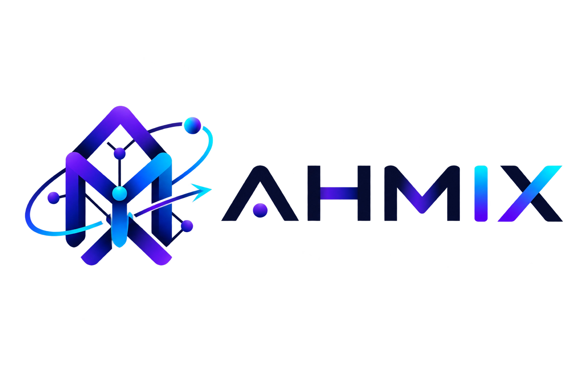

<div align="center">



# AHMIX — Personal Portfolio

**Zero-dependency · Vanilla JS · Fully Handcrafted**

[](https://ahmed28e.github.io/AHMIX/)
[](https://developer.mozilla.org/en-US/docs/Web/HTML)
[](https://developer.mozilla.org/en-US/docs/Web/CSS)
[](https://developer.mozilla.org/en-US/docs/Web/JavaScript)
[](LICENSE)

*"More Than Just AI"*

</div>

---

## Overview

A fully handcrafted personal portfolio for **Ahmed Abdelfatah (AHMIX)** — built from scratch with zero frameworks, zero libraries, and zero build tools. Every pixel, every easing curve, and every micro-interaction is written by hand.

The goal was simple: prove that a skilled frontend engineer doesn't need React, webpack, or npm to ship something production-quality. Just deep knowledge of the platform itself.

> The entire interactive layer — particles, magnetic buttons, 3D tilt, custom cursor, typing effect, marquee, lightbox, and video sync — clocks in at **~26 KB of vanilla JS**. No tree-shaking needed.

---

## Architecture

```
AHMIX-Website/
├── index.html          ← Single-page structure (RTL Arabic, semantic HTML5)
├── style.css           ← Design system + all animations (1,896 lines)
├── script.js           ← 13 self-contained IIFE modules (649 lines)
└── assets/
    ├── fonts/          ← Self-hosted Cairo (Arabic + Latin subsets) & Orbitron
    ├── img/            ← Optimised WebP-ready assets (hero, gallery, certs)
    └── video/          ← H.264 + faststart MP4s (preload="none" by default)
```

### JS Module Map

The entire script runs inside a **single IIFE** with strict mode, exposing nothing to the global scope. Each feature is an independent module with a consistent `{ init() }` interface:

| # | Module | Technique |
|---|--------|-----------|
| 1 | `Preloader` | `requestAnimationFrame` loop with cubic ease-out progress bar |
| 2 | `Cursor` | Dual-layer lerp cursor — dot snaps, glow trails at 16% interpolation |
| 3 | `Magnetic` | Bounding-rect offset → proportional translate on `.magnet` elements |
| 4 | `Particles` | Canvas 2D — 55 particles, O(n²) proximity links, mouse attraction field |
| 5 | `TypeRotator` | Character-level typewriter with variable speed (type/delete/hold) |
| 6 | `Scroll` | `rafThrottle` wrapper around scroll events — header hide/show + active link |
| 7 | `MobileMenu` | Focus-trap pattern, `overflow:hidden` body lock, Escape key close |
| 8 | `Reveal` | `IntersectionObserver` with `unobserve` after first trigger (no re-fire) |
| 9 | `Tilt` | Per-card `rotateX/Y` + `--mx/--my` CSS vars for specular glow tracking |
| 10 | `Marquee` | DOM-built dual-group infinite scroll (CSS animation on 2× content clone) |
| 11 | `Gallery` | Two counter-scrolling rows, lazy-loaded images, click-to-lightbox |
| 12 | `Lightbox` | Shared video+image modal, video pause-on-close, Escape key dismiss |
| 13 | `Featured` | `IntersectionObserver` autoplay with retry logic + timestamp-synced command highlights |

### CSS Design System

All tokens live in `:root` — one place to change the entire visual language:

```css
--bg:          #05060f   /* Deep space black          */
--violet:      #8b5cf6   /* Primary accent             */
--blue:        #4f7cff   /* Secondary accent           */
--cyan:        #2fd9ff   /* Tertiary / highlight       */
--grad:        linear-gradient(120deg, #8b5cf6, #4f7cff, #2fd9ff)
--ease-out:    cubic-bezier(0.22, 1, 0.36, 1)    /* Custom decelerate  */
--ease-spring: cubic-bezier(0.34, 1.56, 0.64, 1) /* Overshoot spring   */
```

Typography is split across two `@font-face` declarations per family using **`unicode-range`** subsetting — Arabic glyphs load `Cairo-Arabic.woff2`, Latin glyphs load `Cairo-Latin.woff2`. Neither file blocks the other.

---

## Notable Implementation Details

### `rafThrottle` — Scroll Performance
```js
const rafThrottle = (fn) => {
  let ticking = false;
  return (...args) => {
    if (ticking) return;
    ticking = true;
    requestAnimationFrame(() => { fn(...args); ticking = false; });
  };
};
```
All scroll and resize handlers are wrapped in this utility. It guarantees at most one handler execution per rendered frame — preventing layout thrashing on cheap devices.

### Particles — Mouse Repulsion / Attraction
Each particle checks its distance to the mouse every frame. Within a 160px radius, it drifts 0.25px toward the cursor per tick — subtle enough to feel alive, cheap enough to stay at 60fps.

### Featured Video — Autoplay Reliability
The video section uses `preload="none"` to avoid bandwidth waste. The `IntersectionObserver` triggers `play()` when 35% of the video is visible, but a race condition exists: `play()` may fire before the browser has buffered enough data. The module handles this with a bounded retry loop (`retries <= 8`, 700ms interval) and fallback listeners on `canplay` and `loadedmetadata`.

### Dynamic Base Path — GitHub Pages Compatible
```js
const isGitHubPages = window.location.hostname.endsWith('github.io');
const baseHref = isGitHubPages && repo ? '/' + repo + '/' : './';
document.write('<base href="' + baseHref + '">');
```
A single inline script writes `<base href>` before any other resource request. No build step, no `homepage` field in `package.json` — it just works on any subdirectory deployment.

### Accessibility Decisions
- `prefers-reduced-motion` detected once at startup — if true, all animation modules early-return and static fallbacks activate
- `prefers-color-scheme` not needed — the dark theme *is* the design, not a mode
- Mobile menu sets `aria-expanded` and locks `body` scroll (not `pointer-events:none` — that breaks iOS momentum scroll)
- All interactive gallery items are `<button>` elements, not `<div onclick>` — keyboard navigable by default

---

## Running Locally

```bash
# Python (no install needed)
python -m http.server 8080
# → http://localhost:8080

# Node.js
npx serve .
# → http://localhost:3000
```

No build step. No `node_modules`. No config files.

---

## Customisation Guide

| What | Where |
|------|-------|
| Typing roles | `script.js` → `TypeRotator` → `WORDS` array |
| Gallery images | `script.js` → `Gallery` → `IMAGES` array |
| Video scene timestamps | `script.js` → `Featured` → `MARKS` array |
| Color tokens | `style.css` → `:root` variables |
| Animation durations | `style.css` — each section has a labelled block |
| Section content | `index.html` — every section is clearly commented |
| WhatsApp / social links | `index.html` → search `wa.me` |

---

## Visual Identity

Colors extracted directly from the AHMIX logo mark:

| Token | Hex | Role |
|-------|-----|------|
| `--bg` | `#05060f` | Background — deep space |
| `--violet` | `#8b5cf6` | Primary — brand purple |
| `--blue` | `#4f7cff` | Secondary — electric blue |
| `--cyan` | `#2fd9ff` | Tertiary — neon cyan |

Fonts: **Cairo** (Arabic + Latin subsets, self-hosted) · **Orbitron** (branding / headings)

---

## Browser Support

Targets modern evergreen browsers. No polyfills shipped.

| Feature | API Used |
|---------|----------|
| Scroll animations | `IntersectionObserver` |
| Particle canvas | `Canvas 2D API` |
| Smooth animations | `requestAnimationFrame` |
| Email copy | `navigator.clipboard` → `execCommand` fallback |
| Media queries in JS | `window.matchMedia` |

---

## License

MIT © 2026 **AHMIX — Ahmed Abdelfatah**

---

<div align="center">
  <sub>Built with obsessive attention to detail. No shortcuts.</sub>
</div>

---

## Scan to Visit

<div align="center">
  
  <br/>
  <sub><code>https://ahmed28e.github.io/AHMIX/</code></sub>
</div>
